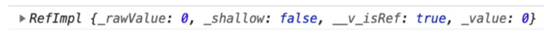
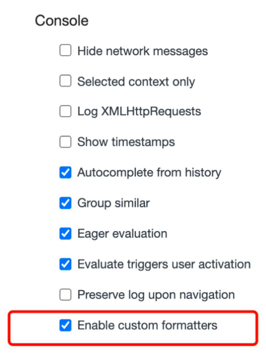
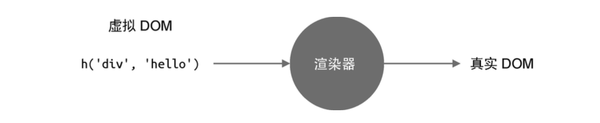
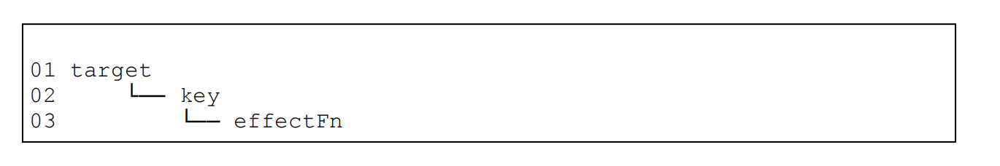
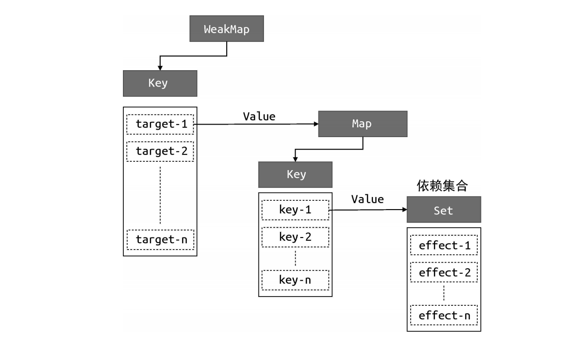
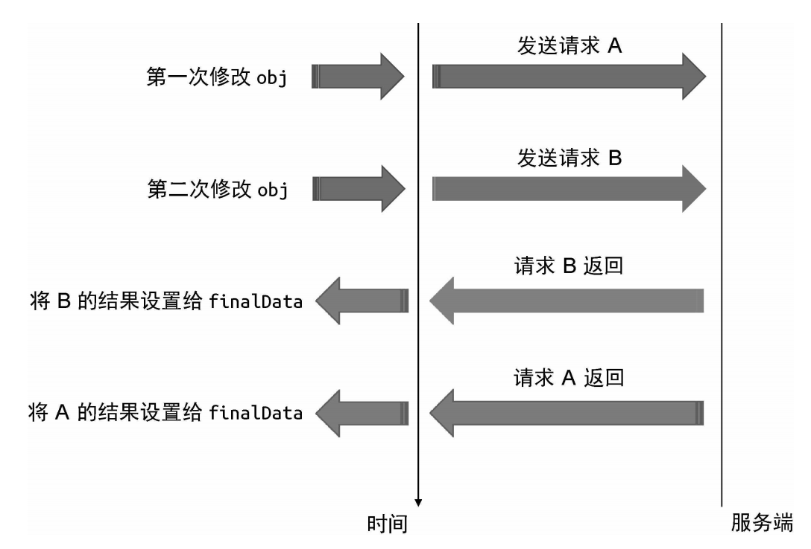
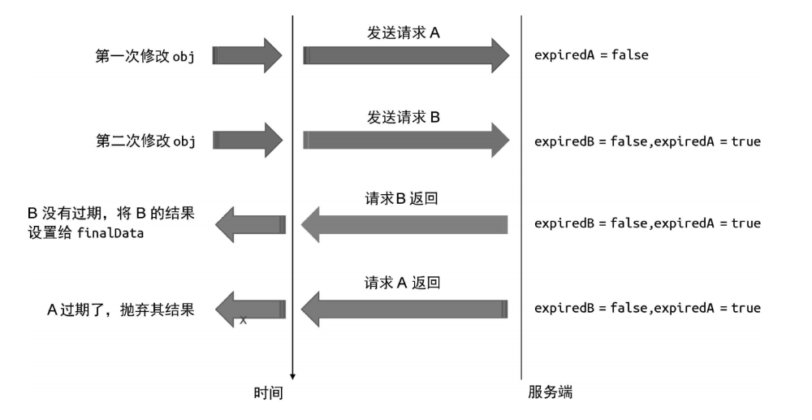

## Vue的设计与实现

### 一、框架设计

> Vue3是一款声明式框架

#### 1.1为什么选择声明式

声明式的选择主要体现在性能与可维护性上的权衡，jquery是典型的命令式框架。

命令式框架和声明式框架在性能上的差异主要体现在修改时，命令式框架可以直观的进行对应位置的修改操作，但是声明式框架要先去寻找要修改的位置，再进行修改，我们把修改的性能消耗定义为A，找出差异的为B

命令式的更新性能消耗为A

声明式的更新性能消耗为A+B

所以声明式的 性能消耗一定是高于命令式的，既然声明式的性能消耗更高为什么还要选择声明式呢？这是因为声明式的代码的可维护性更高，并且极致优化的命令式代码很难书写，并且只要我们让性能消耗B尽可能的减小，那么我们在性能上的差距就可以无限贴近于命令式。

#### 1.2为什么选择运行时+编译时

编译时的架构是指将一段代码直接编译成命令式代码，运行时的架构是指将一段代码通过一个黑盒进行运行，然后再生成命令式代码执行，vue3提供了编译时➕运行时的模式，让我们可以在写类似于html的模版或者直接写树形结构调用Render函数，还是提高了可维护性和书写的便捷性

编译时的优点：因为对代码进行了编译工作，所以可以对用户提供的内容进行分析

### 二、框架设计的核心

#### 2.1提升用户的体验

会用console.warn来反馈出一些方便定位问题所在的信息

小tip：

在我们打印ref数据时，console.log(ref(0))控制台的输出一般是2-1这个样子的



​        	                                              图 2-1

这个显示是不直观的，浏览器支持我们自定义编写formatter从而自定义输出形式，在vue3中可以搜索到initCustomFormatter的函数，该函数就是用于开发环境初始化自定义formatter的，可以在设置中打开



​              	                                              图 2-2

这样我们再打印时可以得到直观的内容


#### 2.2控制框架代码的体积

##### 2.2.1剔除不必要的调试体验代码

因为要提高用户体验，所以框架在设计的时候会有很多的用于发出警告和检查的代码，但这些代码在生产环境中时不需要的，vue在做这个设计的时候采用了环境变量判断的模式

```js
if (__DEV__ && !res) {
  warn(
  	`Faild to mount app......`
  )
}
```

可以看到\__DEV__环境变量在开发环境下为true，在生产环境下为false，如果为false这段代码就永远不会执行了，在用rollup.js进行打包的时候就会被移除，有效的减少了生产环境下的代码体积

##### 2.2.2剔除不必要的废代码或无意义代码

```js
export const isHTMLTag = /*#__PURE__*/ makeMap(HTML_TAGS)
```

也会用/\*#\__PURE__*/来表示这个函数没有副作用，如果该函数只是读一个结果，并且该结果没有赋值给别的单位，最终也会被删除

##### 2.2.3剔除没用的功能代码

框架在设计时会随着更新的迭代产生一些废弃的api，在我们明确我们项目中没有使用时，可以通过相应的配置进行删除处理，例如vue3中如果我们明确我们使用的是Composition API就可以用\__VUE_OPTIONS_API__开关来关闭选项式API的特性，从而减小代码体积

#### 2.3 错误处理

提供统一的错误处理函数

#### 2.4良好的TS支持

### 三、Vue.js 3的设计思路

#### 3.1 声明式地描述UI

> 编写前端页面要涉及的内容
>
> 1、DOM元素
>
> 2、元素的属性
>
> 3、元素的事件
>
> 4、元素的层级结构

Vue选择了和原生基本一致的描述方式来进行**模版**的书写，当然我们也可以用js对象的方式来描述

##### 3.1.1模版描述ui

```vue
<templete>
  <div class="dom" :id="coustomId" @click="handler">
  	<div />
  </div>
</templete>
```

##### 3.1.2js对象描述ui

```js
const vnode = {
  // 标签名称
  tag: 'div',
  // 标签属性
  props: {
    class: 'dom',
    id: coustomId
    onClick: handler
  },
  // 子节点
  children: [
    { tag: 'div' }
  ]
}
export default {
  render() {
    return vnode
  }
}

```

利用h函数

```js
import { h } from 'vue'
export default {
  render () {
    return h('h1', { onClick:handler })
  }
}
```

#### 3.2初始渲染器

Vue先通过渲染函数(.render ) 拿到虚拟DOM，之后再通过渲染器将虚拟DOM转化为真实DOM，如图3-1所示



​														图3-1

```js
const vnode = {
  // 标签名称
  tag: 'div',
  // 标签属性
  props: {
    class: 'dom',
    onClick: handler
  },
  // 子节点
  children: 'click me'
}
export default {
  render() {
    return title
  }
}		
```

先解释一下上面的代码：

- tag用来描述标签名称，所以div就是一个\<div>标签
- props是一个对象，用来描述\<div>标签的属性、事件等内容
- children用来描述标签的子节点，上面代码中是一个字符串，所以代码\<div>有一个文本节点

接下来我们实现一个渲染器

```js
function renderer (vnode, container) {
  const { tag, props, children} = vnode
  // 生成DOM节点
  const el = document.createElement(tag)
  // 处理props属性
  for ( const key in props) {
    // 如果是on开头说明是事件
    if(/^on/.test(key)) {
      el.addEventListener(key.slice(2).toLowerCase(), props[key])
    } else {
      el.setAttribute(key, props[key])
    }
  }
  // 处理children
  if (typeof children === 'string') el.appendChild(document.createTextNode(children))
  else if (Array.isArray(children)) children.forEach(child => renderer(child, el))
  container.appendChild(el)
}
```

当然这只是首次渲染，渲染器复杂的地方在于更新阶段，例如文本内容的变更从click me变更为 click again，渲染器应该只更新元素的文本内容，而不需要走一遍完整的创建过程

#### 3.3组件的本质

组件的本质就是DOM元素的封装，有点像js中的fragment切片，所以我们可以定义一个函数，函数的返回值就是这个页面要渲染的内容

```js
const MyComponent =function () {
  return {
    tag: 'div',
    props: {
      onClick: () => alert(1)
    },
    children: 'click me'
  }
}
```

重构渲染器renderer函数的tag处理部分

```js
function renderer (vnode, container) {
  // 是dom节点
  if (typeof vnode.tag === 'string') mountElement(vnode, container)
  // 是组件节点
  else if (typeof vnode.tag === 'function') mountComponent(vnode, container)
}
```

**mountElement**是之前的renderer函数

```js
function mountElement (vnode, container) {
  const { tag, props, children} = vnode
  // 生成DOM节点
  const el = document.createElement(tag)
  // 处理props属性
  for ( const key in props) {
    // 如果是on开头说明是事件
    if(/^on/.test(key)) {
      el.addEventListener(key.slice(2).toLowerCase(), props[key])
    } else {
      el.setAttribute(key, props[key])
    }
  }
  // 处理children
  if (typeof children === 'string') el.appendChild(document.createTextNode(children))
  else if (Array.isArray(children)) children.forEach(child => renderer(child, el))
  container.appendChild(el)
}
```

**mountComponent**如下，主要是为了生成虚拟DOM，然后再去调用renderer

```js
function mountComponent (vnode, container) {
  // 获取虚拟DOM
  const sunTree = vnode.tag()
  renderer(sunTree, container)
}
```

当然我们知道的Vue的组件展示形式是一个对象，所以最终**renderer、mountComponent**应该是下方这个样子的

**renderer**如下

```js
function renderer (vnode, container) {
  // 是dom节点
  if (typeof vnode.tag === 'string') mountElement(vnode, container)
  // 是组件节点
  else if (typeof vnode.tag === 'object') mountComponent(vnode, container)
}
```

**mountComponent** 如下

```js
function mountComponent (vnode, container) {
  // 获取虚拟DOM
  const sunTree = vnode.tag.render()
  renderer(sunTree, container)
}	
```

#### 3.4模版的工作原理

模版的工作原理其实主要是借助于编辑器，我们知道在写vue时会导出一个对象，编译器让模版生成作用的原理就是在导出的对象上生成一个render函数，返回vnode，**并在进行分析时，将可能发生变化的数据在vnode中标识出来，方便渲染器进行更新时找到哪个地方可能发生变化**

```js
{
  render () {
    return {
      tag: 'div',
      props: {
        id: 'foo',
        class: cls
      },
      patchFlags: 1 //假设数字1代表class是动态的
    }
  }
}
```

### 四、响应系统的作用与实现

#### 4.1响应式数据和副作用函数

在介绍响应式系统之前，我们要先明确一个概念，副作用函数，什么是副作用函数？，用以下代码为例：

```js
function effect () {
  document.body.innerText = 'hello'
}
```

我们修改了body的值为hello，但是body我们不仅在effect函数中可以获取到，在任何地方都可以获取到，所以我们说effect函数是一个副作用函数，总结：副作用函数就是在函数内修改了非仅函数内部可访问的变量的值，对外部数据产生了影响

那这个和响应式有什么关系呢，我们改造一下上面的代码

```js
const obj = {text: 'hello'}
function effect () {
  document.body.innerText = obj.text
}
obj.text = 'change'
```

代码中我们让body的值等于了obj对象的text属性，之后修改了obj的text属性的值，修改后body的值没有跟随着改变，我们期望的是obj的text的值发生了变化，effect函数要重新执行，body的值也跟随着变化，这就是响应式

#### 4.2响应式数据的基本实现

我们期望数据变化，使用数据了的副作用函数就重新执行，这涉及到了两个问题，就是我们怎么知道哪些副作用绑定了该数据，以及我们如何通过副作用函数重新执行，es2015中的proxy可以帮我们解决对应的问题，proxy允许我们在数据读取和修改时创建钩子函数，这样我们就可以在数据读取也就是应用时，将副作用函数收集起来，等到数据修改时，再将副作用函数提取出来进行执行

按照该思路我们进行实现

```js
// 储存副作用函数的桶
const bucket = new Set()
const obj = new Proxy({text: 'hello'},{
  get(target, key) {
    // 将副作用函数收集起来
    bucket.add(effect)
    return target[key]
  },
  set(target, key, newValue) {
    const setRes = Reflect.set(...arguments)
    // 将副作用函数从桶中拿出来执行
    bucket.forEach(fn=>fn())
    return setRes
  }
})
const effect = ()=>{
  document.body.innerText = obj.text
}
effect()
setTimeout(()=>obj.text = 'change',1000)
```

至此我们就实现了一个基础版的响应式，但是其中还有很多的问题，例如我们在收集副作用的时候明确了副作用函数是effect，我们在后面会解决这些问题

#### 4.3设计一个完善的响应式系统

我们先解决副作用函数的命名问题，我们期望可以明确一个变量指向副作用函数，同时期望使用的人可以随意给自己的副作用函数命名，我们可以提供一个函数来进行对应的转换，代码如下

```js
let activeEffect = undefined
function effect (fn) {
  activeEffect = fn
  fn()
}
```

至此我们已经解决了副作用函数的命名问题，但随之而来的问题是我们的副作用收集并不够明确，obj是一个对象，对象会有很多的属性，我们在收集副作用时，将所有的副作用都与对象绑定了，然而这个并不够准确，例如下面的例子

```js
effect(()=>{
  console.log('执行了副作用函数')
  document.body.innerText = obj.text
})
obj.noProps = true
```

我们会发现，在修改obj的noProps属性时，副作用函数也执行了，然而我们期望的是仅修改副作用函数中用到的变量的对应的属性的时候才会执行对应的副作用函数，因此我们需要修改一下我们的绑定关系，从最开始的对象变为对象的对应属性，我们从新设计桶的数据结构



```js
const bucket = new WeakMap()
```

调整我们的副作用收集和副作用执行的位置，也就是proxy监听的get和set函数，我们将收集和执行行为单独写成两个函数track和trigger

```js
// 副作用收集函数
function track(target, key) {
  // 没有副作用函数返回
  if (!activeEffect) return
  // 该对象是否有副作用函数
  let depsMap = bucket.get(target)
  if(!depsMap) bucket.set(target, (depsMap = new Map()))
  // 该属性是否有副作用函数
  let deps = depsMap.get(key)
  if(!deps) depsMap.set(key,(deps = new Set()))
  // 将副作用函数和该属性进行绑定
  deps.add(activeEffect)
}

// 副作用执行函数
function trigger(target, key) {
  const depsMap = bucket.get(target)
  if(!depsMap) return
  const deps = depsMap.get(key)
  if(!deps) return
  deps.forEach(fn=>fn())
}
```

修改代理proxy的set和get函数

```js
const obj = new Proxy({text: 'hello'},{
  get(target, key) {
    // 将副作用函数收集起来
    track(target, key)
    return target[key]
  },
  set(target, key, newValue) {
    const setRes = Reflect.set(...arguments)
    // 将副作用函数从桶中拿出来执行
    trigger(target, key)
    return setRes
  }
})
```

至此我们的整个数据结构如下



#### 4.4分支切换与cleanup

我们已经实现了一个相对完善的响应式系统了，但是还有一些特殊的情况需要去处理，例如三元表达式的分支切换，以下面的代码为例

```js
effect(()=>{
  document.body.innerText = obj.ok ? obj.text : 'none'
})
```

在这个副作用函数中，我们期待的是obj的ok为true时，obj的text属性改变副作用函数重新执行一遍，当obj.ok为false的时候，obj.text改变，副作用函数不重新执行

我们目前的响应式系统并不能实现这一需求，当obj.ok为true时，obj对象的ok和text属性都会绑定该副作用,obj.ok的值改为false后，重新执行副作用函数，obj的ok属性会绑定该副作用函数，**问题出现了**，这个时候并没有断开obj的text属性和副作用函数的绑定

解决这一问题的方法很简单，我们只需要在副作用函数执行前，先断开之前的所有响应绑定，然后副作用函数执行，会重新绑定最新准确的依赖关系，以上面的例子为例，就是obj.ok更改为false，之后副作用函数清空响应绑定，也就是断开和obj.ok和obj.text的依赖关系，这样不管两个值接下来怎么改变都不会触发副作用函数的执行了，之后副作用函数执行，因为本次obj.ok的值为false，所以只会触发obj.ok的get，重新建立依赖

好的解决逻辑已经有了，但是新的问题又出现了，就是我们怎么通过副作用函数知道它都和谁有依赖，我们之前的响应式系统都是单向的，也就是我们可以通过对象和对象的属性定位到这个属性的副作用函数，没有办法反向定位，所以我们要重新设计一些我们的副作用函数effect，处理方法如下

```js
// 原
let activeEffect = undefined
function effect (fn) {
  activeEffect = fn
  fn()
}
// 新
let activeEffect = undefined
function effect (fn) {
  const effectFn = ()=> {
    activeEffect = effectFn
    fn()
  }
  effectFn.deps = []
  effectFn()
}
```

可以看到我们新写了一个effectFn函数，并将activeEffect指向了这个函数，可能有的人会疑惑，为什么要多次一举让activeEffect指向这个函数，直接等于fn不可以么，这是因为函数保存的也是引用地址，如果我们让activeEffect直接等于fn，后面挂载属性deps时会导致传入的函数fn上也同步修改了deps属性为空对象，破坏了传入的参数。

现在我们的effect函数有了反向收集的地方了，我们只需要改写一下track函数，在进行对象的属性和副作用函数绑定的阶段进行双向绑定

```js
function track(target, key) {
  // 没有副作用函数返回
  if (!activeEffect) return
  // 该对象是否有副作用函数
  let depsMap = bucket.get(target)
  if(!depsMap) bucket.set(target, (depsMap = new Map()))
  // 该属性是否有副作用函数
  let deps = depsMap.get(key)
  if(!deps) depsMap.set(key,(deps = new Set()))
  // 将副作用函数和该属性进行绑定
  deps.add(activeEffect)
  // 将该属性的副作用桶绑定给该副作用
  activeEffect.deps.push(deps)
}
```

现在我们已经可以通过副作用函数去找到对应都哪些桶中有它了，只要在执行前将它从这些桶中删除，副作用的执行发生在trigger，可以发现最后执行的是activeEffect，目前我们的activeEffect是一个函数，我们新写一个用于清除掉方法，cleanup，放在副作用函数执行前执行

```js
let activeEffect = undefined
function effect (fn) {
  const effectFn = ()=> {
    cleanup(effectFn)
    activeEffect = effectFn
    fn()
  }
  effectFn.deps = []
  effectFn()
}
```

```js
function cleanup (effectFn) {
  for (let i=0;i<effectFn.deps.length;i++) {
    const deps = effectFn.deps[i]
    deps.delete(effectFn)
  }
  effectFn.deps.length = 0
}
```

我们允许后发现页面卡死了，这是因为我们在执行阶段，也就是trigger使用的是deps.forEach的方法，在循环便利时，我们不断的对deps做delete和add，导致这个forEach一直运行，无限循环了，解决方法也很简单，我们在执行时将deps拷贝一份后再去执行就好了

```js
function trigger(target, key) {
  const depsMap = bucket.get(target)
  if(!depsMap) return
  const deps = depsMap.get(key)
  // 拷贝一份deps
  const effectsToRun = new Set(deps)
  effectsToRun.forEach(fn=>fn())
}
```

#### 4.5嵌套的effect与effect栈

现在我们需要处理的问题是effect的嵌套问题，也就是在effect函数中又调用了effect函数，这是很有可能的事情，我们目前的系统副作用收集流程是这样的


其中修改全局activeeffect是一个很重要的环节，这关系着我们在响应式get环节绑定的副作用函数是否准确，当我们的effect函数发生潜逃关系的时候会导致我们的activeEffect指向不符合预期，以下面的代码为例

```js
let temp1 = undefined
let temp2 = undefined
effect(function effectFn1() {
  console.log('执行了effectFn1')
  effect(function effectFn2() {console.log('执行了effectFn2'); temp2 = obj.text})
  temp1 = obj.ok
})
```

我们修改obj.ok的值，控制台可以看到打印了**执行了effectFn2**

```js
// effect运行的打印
执行了effectFn1
执行了effectFn2
// obj.ok = false
执行了effectFn2
// obj.text = 'hh'
执行了effectFn2
```

可以看到不论是obj.ok还是obj.text绑定的副作用函数都是effectFn2，然而我们期待的是obj.ok绑定的副作用函数是effectFn1，obj.text绑定的副作用函数是effectFn2，造成这个的原因是什么呢，我们分析一下上面的effect执行过程中activeEffect的指向

```js
effect(function effectFn1() {
  // effectFn1开始执行了，这时候activeEffect指向effectFn1
  console.log('执行了effectFn1')
  effect(function effectFn2() {
    // effectFn2开始执行了，这时候activeEffect指向effectFn2
   	 	console.log('执行了effectFn2')
    // 这个时候触发了obj.text属性的读取触发响应式的get，依赖绑定obj.text和activeEffect绑定即effectFn2绑定
    	temp2 = obj.text
  	}
  )
  // effectFn2函数执行完毕，触发obj.ok属性的读取，触发响应式的get，进行依赖绑定obj.ok和activeEffect绑定即effectFn2绑定
  temp1 = obj.ok
})
```

通过上面的分析我们发现了问题所在，就是effectFn2函数在执行完毕后，activeEffect函数并没有重新指向回effectFn1，还停留在effectFn2，下面我们进行解决，

js的函数任务执行是在一个栈结构中运行的，有着先入后出的特点，我们为effect也同样建立一个栈，并且让activeEffect始终指向这个effect栈的最上层，这样就可以保证我们的activeEffect是准确的了

```js
let activeEffect = undefined
// effect栈
const effectStack = []
function effect (fn) {
  const effectFn = ()=> {
    cleanup(effectFn)
    activeEffect = effectFn
    // 将副作用推入到栈中
    effectStack.push(effectFn)
    fn()
    // 函数执行完毕将副作用函数推出栈
    effectStack.pop()
    // 让activeEffect执行effect栈的最上层
    activeEffect = effectStack[effectStack.length - 1]
  }
  effectFn.deps = []
  effectFn()
}
```

#### 4.6避免无限递归循环

当副作用函数中即会触发响应式数据的读取和赋值操作的时候就会造成无限递归循环，在读取的时候进行了依赖绑定，将副作用和响应式数据进行绑定，之后进行赋值操作，会触发副作用函数的执行，副作用函数执行又触发了响应式数据的读取和赋值，形成循环，造成无限递归循环，以下面的代码为例

```js
const data = {foo: 1}
const obj = new Proxy(data,options)
effect(()=>obj.foo++)
```

通过执行会发现我们的操作导致栈溢出了，造成这一问题的主要原因出现在数据的赋值操作上，因为赋值的时候才会又造成行为的循环，所以我们只需要判断一下，赋值时触发的副作用函数和当前正在执行的副作用函数是否是同一个，如果是同一个，那么就不用再执行了，我们修改一下trigger函数

```js
function trigger(target, key) {
    const depsMap = bucket.get(target)
    if(!depsMap) return
    const deps = depsMap.get(key)
    const effectsToRun = new Set()
    deps && deps.forEach(effectFn=>{
        if(effectFn!==activeEffect) {
            effectsToRun.add(effectFn)
        }
    })
    effectsToRun.forEach(fn=>fn())
}
```

#### 4.7调度执行

什么叫调度执行，即控制响应式触发副作用的时机，以下面的代码为例

```js
const data = {foo: 1}
const obj = new Proxy(data, options)
effect(()=>console.log(obj.foo))
obj.foo++
console.log('结束了')
```

执行结果
```js
1
2
'结束了'
```

如果我们的响应式系统可以进行调度执行，那么我们可以实现让执行结果变为1,'结束了',2，我们需要修改副作用函数和副作用函数的执行阶段trigger函数

```js
function effect (fn, options = {}) {
  const effectFn = ()=> {
    cleanup(effectFn)
    activeEffect = effectFn
    // 将副作用推入到栈中
    effectStack.push(effectFn)
    fn()
    // 函数执行完毕将副作用函数推出栈
    effectStack.pop()
    // 让activeEffect执行effect栈的最上层
    activeEffect = effectStack[effectStack.length - 1]
  }
  effectFn.options = options
  effectFn.deps = []
  effectFn()
}
```

```js
function trigger(target, key) {
    const depsMap = bucket.get(target)
    if(!depsMap) return
    const deps = depsMap.get(key)
    const effectsToRun = new Set()
    deps && deps.forEach(effectFn=>{
        if(effectFn!==activeEffect) {
            effectsToRun.add(effectFn)
        }
    })
    effectsToRun.forEach(fn=>{
        if(fn.options.scheduler) {
            fn.options.scheduler(fn)
        }else {
            fn()
        }
    })
}
```

我们修改了effect函数，允许effect函数传递options，options中的scheduler负责进行调度执行，允许用户自己操控副作用函数的执行时机

#### 4.8计算属性computed和lazy

我们来实现vue的computed，在vue中我们使用的时候会使用computed传入一个函数，从而使得我们在使用computed函数获得的值被读取时永远是最新的值，这个函数就是我们前面实现的副作用函数，并且computed得到的对象是一个有value属性的只读对象

```JS
function computed(getter) {
    const effectFn = effect(getter)
    const obj = {
        get value() {
            return effectFn
        }
    }
    return obj
}
```

我们实现了一个初步的computed函数，获取到了一个带有value只读属性的对象，但是effect副作用函数并没有返回值，我们需要effect函数有返回值，并且副作用getter只有在读取的时候才执行，我们需要改写一下computed函数，和effect函数，并在options中新加一个属性lazy，来控制副作用是否要执行

```js
function computed(getter) {
    const effectFn = effect(getter,{
        lazy: true
    })
    const obj = {
        get value() {
            return effectFn()
        }
    }
    return obj
}
function effect (fn, options) {
  const effectFn = ()=> {
    cleanup(effectFn)
    activeEffect = effectFn
    // 将副作用推入到栈中
    effectStack.push(effectFn)
    // 新增返回函数的执行结果
    const res = fn()
    // 函数执行完毕将副作用函数推出栈
    effectStack.pop()
    // 让activeEffect执行effect栈的最上层
    activeEffect = effectStack[effectStack.length - 1]
    return res
  }
  effectFn.options = options
  effectFn.deps = []
  // lazy为true则不执行
  if(!options.lazy) effectFn()
  return effectFn
}
```

computed还有缓存的属性在，也就是如果响应式依赖的数据没有变化，则computed不会去重复触发副作用函数，我们修改一下computed函数
```js
function computed(getter) {
    let value
    let dirty = true
    const effectFn = effect(getter,{
        lazy: true,
        scheduler() {
            dirty = true
        }
    })
    const obj = {
        get value() {
            if (dirty) {
                value = effectFn()
                dirty = false
            }
            return value
        }
    }
    return obj
}
```

我们新增了调度器，当相适应依赖数据发生变化时会触发调度器，这样我们就可以通过调度器来控制dirty，用dirty做开关，控制是否要重新执行effectFn。现在的computed已经趋于完美了，但是还有一个缺陷，就是computed不能用于effect函数中，不会形成依赖绑定，以下面的代码为例

```js
const com = computed(()=>{
    console.log('执行了computed')
    return obj.text + obj.ok
})
effect(()=>console.log(com.value))
setTimeout(()=>obj.text = 'change')
```

我们打开控制台可以发现执行结果如下

```js
执行了computed
hellotrue
```

可以看到只打印了一次'执行了computed'，这证明computed中的副作用函数只执行了一次，这和我们期待的是不相符的，我们期待的是在effect函数执行时会读取一次com.value的值，当我们修改obj.text时，com的value值也应该发生了改变，并且触发effect函数，之所以造成我们预料之外的情况是因为computed得到的并不是一个传统的响应式对象，他的value值没有在get的时候去收集依赖，value的依赖性改变的时候没有重新执行依赖，我们需要改造一下computed函数

```js
function computed(getter) {
    let value
    let dirty = true
    const effectFn = effect(getter,{
        lazy: true,
        scheduler() {
            if (!dirty){
                dirty = true
            	trigger(obj, 'value')
            }
        }
    })
    const obj = {
        get value() {
            if (dirty) {
                value = effectFn()
                dirty = false
                track(obj, 'value')
            }
            return value
        }
    }
    return obj
}
```

我们修改了computed函数，让obj的value值get的时候进行副作用绑定，在依赖数据变化触发的scheduler调度中进行trigger执行副作用函数，至此一个完成的computed函数就完成了

#### 4.9watch的实现原理

先对vue中的watch功能进行拆解，首先是第一个参数可以是一个响应式的对象或者是一个伴有返回值的函数，第二个参数是回调函数，有两个参数，旧的值和新的值

通过拆分我们发现我们需要实现的事情在上面都有实现过了，首先是想执行回调函数，我们可以利用effect的调度器来进行，第二个就是拿到对应的值，我们可以使用lazy参数来进行实现，

已经明确了写法，我们来进行代码实现

```js
function watch(source, cb) {
    let getter
    if (typeof source === 'function') getter = source
    else getter = () => traverse(source)
    
}
// 我们需要读取响应式对象的每个属性，这样才能将每个属性都绑定依赖关系
function traverse(value, seen = new Set()) {
    if(typeof value !== 'object' || value === null || seen.has(value)) {
        return
    }
    // 主要防止对象的循环引用
    seen.add(value)
    for (let k in value) {
        traverse(value[k], seen)
    }
    return value
}
```

我们实现了watch的第一个参数，既可以传递响应式数据，也可以传递一个函数，当传递响应式的数据的时候，我们需要遍历的读取响应式数据的所有值，这样才能对响应式数据的每个属性都形成绑定关系

我们来实现后续的内容

```js
function watch(source, cb) {
    let getter
    if (typeof source === 'function') getter = source
    else getter = () => traverse(source)
    effect(getter,{
        scheduler() {
            cb()
        }
    })
}
```

我们通过effect将响应式对象进行了绑定，并通过scheduler调度器，在响应式对象变化的时候可以触发调度器执行回调

```js
function watch(source, cb) {
    let getter
    let oldValue, newValue
    if (typeof source === 'function') getter = source
    else getter = () => traverse(source)
    const effectFn = effect(getter,{
        scheduler() {
            newValue = effectFn()
            if(oldValue === newValue) return
            cb(oldValue, newValue)
            oldValue = newValue
        },
        lazy: true
    })
    oldValue = effectFn()
}
```

#### 4.10过期的副作用

在watch中使用数据监听去发送网络请求可能会出现竞态问题，以下面这段代码为例

```js
let finalData
watch(obj, async () => {
// 发送并等待网络请求
const res = await fetch('/path/to/request')
// 将请求结果赋值给 data
finalData = res
})
```

我们用watch去监听了obj，希望obj的值发生改变的时候，去发送网络请求去把结果赋值给finalData，这里会出现finalData的值不是我们预期值的问题，我们短时间内连续修改了两次obj，会触发两次wathc的回调操作，但是因为回调中是有网络请求的，所以我们不能保证后一次的回调操作完成是在前一次之后的，也就是可能第二次回调先执行完毕，之后第一次回调才执行完毕，导致finalData的值其实是第一次回调后的结果，不是第二次的



我们需要增强我们的watch函数以实现可以控制这一行为，使用阶段我们为了避免这种行为的发生，我们会用一个开关控制，例如下面

```js
watch(obj, async () => {
let expired = false
// 发送并等待网络请求
const res = await fetch('/path/to/request')
// 将请求结果赋值给 data
if (!expired) {
    finalData = res
}
})
```

我们定义了一个变量expired，只有expired为false的时候才会进行赋值操作，现在我们需要一个时机来修改expired的值，我们可以利用闭包，在watch中定义一个变量，让第一次回调的时候去修改这个变量的值，然后在触发第二次回调的时候前，先去判断这个变量有没有值，有的话去执行，这样我们就可以在第一次回调的时候给这个值一个方法，来修改回调中的expired值来控制是否使用该次回调的结果了

```js
watch(obj, async (newValue, oldValue, onInvalidate) => {
let expired = false
// onInvalidate用于给watch中的变量赋值
onInvalidate(()=>expired=true)
// 发送并等待网络请求
const res = await fetch('/path/to/request')
// 将请求结果赋值给 data
if (!expired) {
    finalData = res
}
})
```

```js
function watch(source, cb) {
    let getter
    let oldValue, newValue
    if (typeof source === 'function') getter = source
    else getter = () => traverse(source)
    
    let cleanup
    function onInvalidate (fn) {
        cleanup = fn
    }
    const effectFn = effect(getter,{
        scheduler() {
            newValue = effectFn()
            if (oldValue === newValue) return
            if (cleanup) cleanup()
            cb(oldValue, newValue, onInvalidate)
            oldValue = newValue
        },
        lazy: true
    })
    oldValue = effectFn()
}
```

这样我们就可以处理过期的副作用了，整个流程大致如下



### 五、非原始值的响应式方案

#### 5.1理解Proxy和Reflect

Vue3的响应式是有proxy来实现的，所以我们要先了解一下proxy的边界问题，proxy只能代理**对象**的**基本语义**，什么是基本语义呢，所谓的基本语义就是类似与读取和设置属性值这种基本操作，在JavaScript中，万物皆对象，同样函数也是一个对象，那既然是对象我们就可以进行代理操作。

```JS
const fn = (name) => {
    console.log('我是',name)
}
const obj = new Proxy(fn,{
    apply(t,thisArg, argArray) {
        t.call(thisArg, ...argArray)
    }
})
obj('yxy')
```

输出：

```js
我是 yxy
```

在这个操作中，有个很有意思的点，就是我们是使用call方法去调用的，而不是使用fn方法直接调用，这主要是因为this的指向问题。

刚刚讲了基本操作，现在我们来说一下复合操作，什么叫复合操作呢，就是多个基本操作组合在一起，例如以下操作

```js
obj.fn()
```

这一行为下，我们进行了两个操作，一个是fn属性的读取操作，另一个是fn属性的调用操作，这种复杂操作Proxy就不能进行代理了，用下面的代码为例

```js
const fn = (name) => {
    console.log('我是',name)
}
const obj = new Proxy({fn},{
    get(t,k){
        console.log('触发了get')
        return t[k]
    },
    apply(t,thisArg, argArray) {
        console.log('触发了apply')
        t.call(thisArg, ...argArray)
    }
})
obj.fn()
```

输出结果

```js
触发了get
我是 undefined
```

现在我们再聊一聊Reflect，什么是Reflect，Reflect是一个全局对象，并且它并非是 一个构造函数，所以并不能使用new的形式来调用，，它类似与Math，有许多的静态方法，例如：

```js
Reflect.get()
Reflect.set()
Relfect.apply()
...
```

你会发现，Reflect中的方法和Proxy的第二个参数拦截器中的方法名字相同，任何proxy拦截器中可以找到的方法，在Reflect中都可以找到，我们以下面的Reflect.get为例，看一下Reflect都可以做些什么

```js
const obj = {foo: 1}
// 读取obj的foo属性
Reflect.get(obj, 'foo') //=> 1
```

可以看到我们可以通过使用get方法去读取一个对象的值，我们明明可以去直接获取，为什么要用函数调用呢，这是因为它还有第三个参数receiver，它主要用于修改对象中getter指定的this的值，以下面的例子为例

```js
const obj = {foo: 1}
// 读取obj的foo属性
Reflect.get(obj, 'foo',{foo: 2}) //=> 2
```

那这和响应式有什么关系呢，我们以下面的代码为例

```js
const y = {
    foo:1,
    get bar() {
        return this.foo
    }
}
const obj = new Proxy(y,{
    get(t,k,r){
        console.log('触发了get',k)
        return t[k]
    },
})
obj.bar
```

输出：

```js
obj.bar
触发了get bar
```

我们会发现，代理的get函数只触发了一次，按照预期应该是要触发两次的，一次为bar值的获取触发，一次为foo的获取触发，这是为什么呢，主要是因为this指向的问题，在我们获取bar的值是，调用了this.foo，但是因为我们在get拦截的时候使用的是t[k]，所以在bar执行的时候，this指向的是t也就是我们的y对象，而不是obj代理对象，导致在读取foo的时候就没有触发代理，我们只需要借用Reflect就可以解决

```js
const y = {
    foo:1,
    get bar() {
        return this.foo
    }
}
const obj = new Proxy(y,{
    get(t,k,r){
        console.log('触发了get',k)
        return Reflect.get(t,k,r)
    },
})
obj.bar
```

输出结果
```js
触发了get bar
触发了get foo
```

#### 5.2如何代理对象Object

首先我们要知道对象都可以做哪些操作，设置，读取，删除，明确了操作我们还要明确我们具体的调用方法，读取比较特殊，有多种方法都会触发读取，以下为列：

```js
//第一种 直接读取
obj.foo
//第二种 判断是否有属性
foo in obj
//第三种 循环
for(const k in obj)
```

这三种方法都会触发obj对象的读取，接下来我们说设置

```js
obj.foo = 1
obj.bar = 1
```

设置的类型就比较简单，只有设置已有属性和设置新属性

最后是删除

```js
delete obj.foo
```

明确了各种操作后，我们就要开始思考代理的过程了，目前我们的响应式只会拦截get个set操作，然而我们发现，在进行... in ...操作时还有for...in...循环操作时并不出触发get拦截，查阅ESMA的相关规范发现，...in...操作的拦截方法为has，而for...in...拦截方法为ownkeys，delete的拦截方法为deleteProperty，现在我们结合上面提到的Reflect优化一下我们的响应式代码，首先是has拦截

```js
const obj = new Proxy(
        { text: "hello", ok: true },
        {
          get(target, key, receiver) {
            // 将副作用函数收集起来
            track(target, key);
            return Reflect.get(target, key, receiver);
          },
          set(target, key, newValue, receiver) {
            const setRes = Reflect.set(target, key, newValue, receiver);
            // 将副作用函数从桶中拿出来执行
            trigger(target, key);
            return setRes;
          },
            // 新增
          has(target, key) {
            track(target, key);
            return Reflect.has(target, key);
          },
        }
      );
```

之后是for循环的拦截，for循环的拦截有一些特殊，就是每次一个完整的循环只会触发一次拦截，并且没有key这个参数，所以我们需要自己创造一个参数，下面代码为例

```js
const ISERATE_KEY = Symbol()
const obj = new Proxy({text:'hello',ok:true},{
	get(target, key, receiver) {
        track(target, key);
        return Reflect.get(target, key, receiver);
    },
    set(target, key, newValue, receiver) {
        const setRes = Reflect.set(target, key, newValue, receiver);
        trigger(target, key);
        return setRes;
    },
    has(target, key) {
        track(target, key);
        return Reflect.has(target, key);
    },
    ownKeys(target) {
        track(target, ISERATE_KEY);
        return Reflect.ownKeys(target)
    }
})
```

以为有了新的key所以我们的trigger阶段也需要特殊处理一下，在触发副作用的时候不仅要看对象上的属性有没有副作用还要看一下循环属性上有没有副作用

```js
function trigger(target, key) {
    const depsMap = bucket.get(target)
    if(!depsMap) return
    const deps = depsMap.get(key)
    const iserateEffects = depsMap.get(ISERATE_KEY)
    const effectsToRun = new Set()
    deps && deps.forEach(effectFn=>{
        if(effectFn!==activeEffect) {
            effectsToRun.add(effectFn)
        }
    })
    // 将与 ITERATE_KEY 相关联的副作用函数也添加到 effectsToRun
    iserateEffects && iserateEffects.forEach(effectFn=>{
        if(effectFn!==activeEffect) {
            effectsToRun.add(effectFn)
        }
    })
    effectsToRun.forEach(fn=>{
        if(fn.options.scheduler) {
            fn.options.scheduler(fn)
        }else {
            fn()
        }
    })
}
```

但是这样新的问题就又产生了，就是我们希望什么时候才会触发for...in...循环的副作用，目前我们的响应式代码不论是新增属性还是修改旧属性，如果有for...in...循环都会触发循环副作用，我们认为单看循环本身和对象直接的联系，对象的属性值数量是影响循环的唯一条件，也就是说，应当只有对象上的属性值增加或减少才会触发循环的副作用，

我们需要修改set拦截器，因为无论是新增还是修改本质都是设置，并且会被set拦截到，我们在set的时候验证一下这个key是哪种类型，并通知触发器trigger，修改代码如下

```js
const TriggerType = {
    ADD: 'ADD',
    SET: 'SET'
}
const obj = new Proxy({text:'hello',ok:true},{
	get(target, key, receiver) {
        track(target, key);
        return Reflect.get(target, key, receiver);
    },
    set(target, key, newValue, receiver) {
        const type = Object.prototype.hasOwnProperty.call(target, key)?TriggerType.SET : TriggerType.ADD
        const setRes = Reflect.set(target, key, newValue, receiver);
        trigger(target, key, type);
        return setRes;
    },
    has(target, key) {
        track(target, key);
        return Reflect.has(target, key);
    },
    ownKeys(target) {
        track(target, ISERATE_KEY);
        return Reflect.ownKeys(target)
    }
})

function trigger(target, key, type) {
    const depsMap = bucket.get(target)
    if(!depsMap) return
    const deps = depsMap.get(key)
    const iserateEffects = depsMap.get(ISERATE_KEY)
    const effectsToRun = new Set()
    deps && deps.forEach(effectFn=>{
        if(effectFn!==activeEffect) {
            effectsToRun.add(effectFn)
        }
    })
    // 将与 ITERATE_KEY 相关联的副作用函数也添加到 effectsToRun
   if(type === TriggerType.ADD) {
		iserateEffects && iserateEffects.forEach(effectFn=> {
            if(effectFn!==activeEffect) {
            	effectsToRun.add(effectFn)
        	}
        })
   }
    effectsToRun.forEach(fn=>{
        if(fn.options.scheduler) {
            fn.options.scheduler(fn)
        }else {
            fn()
        }
    })
}
```

现在我们来处理删除，因为删除也会影响对象的属性数量，所以同样会触发循环的副作用，我们添加拦截器的同时修改一下trigger和TriggerType

```js
const TriggerType = {
    ADD: 'ADD',
    SET: 'SET',
    DELETE: 'DELETE'
}

const obj = new Proxy({text:'hello',ok:true},{
	get(target, key, receiver) {
        track(target, key);
        return Reflect.get(target, key, receiver);
    },
    set(target, key, newValue, receiver) {
        const type = Object.prototype.hasOwnProperty.call(target, key)?TriggerType.SET : TriggerType.ADD
        const setRes = Reflect.set(target, key, newValue, receiver);
        trigger(target, key, type);
        return setRes;
    },
    has(target, key) {
        track(target, key);
        return Reflect.has(target, key);
    },
    ownKeys(target) {
        track(target, ISERATE_KEY);
        return Reflect.ownKeys(target)
    },
    deleteProperty(target, key) {
        const hasKey = Object.prototype.hasOwnProperty.call(target, key)
        const res = Reflect.deleteProperty(target, key)
        if(res && hasKey) {
            trigger(target, key, TriggerType.DELETE)
        }
        return res
    }
})

function trigger(target, key, type) {
    const depsMap = bucket.get(target)
    if(!depsMap) return
    const deps = depsMap.get(key)
    const iserateEffects = depsMap.get(ISERATE_KEY)
    const effectsToRun = new Set()
    deps && deps.forEach(effectFn=>{
        if(effectFn!==activeEffect) {
            effectsToRun.add(effectFn)
        }
    })
    // 将与 ITERATE_KEY 相关联的副作用函数也添加到 effectsToRun
   if(type === TriggerType.ADD || type === TriggerType.DELETE) {
		iserateEffects && iserateEffects.forEach(effectFn=> {
            if(effectFn!==activeEffect) {
            	effectsToRun.add(effectFn)
        	}
        })
   }
    effectsToRun.forEach(fn=>{
        if(fn.options.scheduler) {
            fn.options.scheduler(fn)
        }else {
            fn()
        }
    })
}
```


